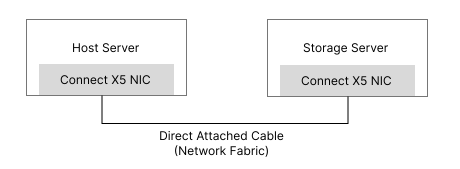

## Setting Environments

---

### Prerequisities



- TCP로 연결된 두 물리 서버가 필요합니다.
- 두 서버 간 TCP 연결이 필요하기 때문에, 각각의 서버를 위한 별도의 네트워크 인터페이스 카드와 사설 IP를 준비하는 것을 추천합니다.
- 네트워크를 구성할 때 공유기를 거치도록 구축해도 큰 문제는 없지만, 정확한 실험 환경을 위해 호스트와 Target 서버 간 직접 연결을 추천합니다.
- **(중요) 이 프로젝트를 다운로드 받고 nvme-cli 폴더는 Host 서버에, spdk 폴더는 Target 서버에 위치하세요.**

### Setting Up Development Environment

플랫폼 개발환경을 구성하는 과정은 아래와 같습니다.

먼저 Target 서버에서 SPDK 어플리케이션을 구동하고, 이 어플리케이션 내에 TCP Transport와 Bdev 인터페이스를 구성합니다.

이후 Host 서버는 Target 서버의 SPDK TCP Transport와 연결을 맺고 파일시스템을 초기화합니다.

---

#### Target Side

아래는 Target 서버에서 수행할 작업입니다.

```shell
cd spdk
```

1. 먼저 Target 서버에서 SPDK를 빌드합니다.
```shell
sudo ./configure
sudo make -j `nproc`
```

2. 빌드된 SPDK의 바이너리를 실행합니다.

```shell
sudo build/bin/nvmf_tgt # 또는 명령어 뒤에 &를 붙여 백그라운드로 실행하세요(선택사항).
```

3. SPDK 내에 NVMe over Fabric TCP Target의 서브시스템을 구성합니다. 구체적으로, TCP Transport 및 Bdev 인터페이스를 구성합니다.

```shell
# 새로운 쉘을 열고 아래 명령어들을 실행하세요.
sudo sudo scripts/rpc.py nvmf_create_transport -t TCP -u 131072 -m 20 -c 8192 -i 2097152 # SPDK의 TCP Transport 스펙을 확인하여 구성하세요. 좌측에 나와있는 것은 참고만 하세요.
sudo scripts/rpc.py bdev_malloc_create -b Malloc0 1024 4096
sudo scripts/rpc.py nvmf_create_subsystem nqn.2016-06.io.spdk:cnode1 -a -s SPDK00000000000001 -d <device>(ex. /dev/nvme0n1)
sudo scripts/rpc.py nvmf_subsystem_add_ns nqn.2016-06.io.spdk:cnode1 Malloc0
sudo scripts/rpc.py nvmf_subsystem_add_listener nqn.2016-06.io.spdk:cnode1 -t tcp -a <target ip>(ex. 192.168.0.5) -s <port>(ex. 4420)
```

#### Host Side

아래는 Host 서버에서 수행할 작업입니다.

1. SPDK Target TCP Transport와 연결

```shell
sudo nvme connect -t tcp -n nqn.2016-06.io.spdk:cnode1 -a <target ip>(ex. 192.168.0.5) -s <port>(ex. 4420)
sudo nvme list # 이 명령어를 수행하여 연결이 잘되었는지 확인하세요(선택사항) 
```

2. nvme-cli 구성 및 Host 서버에 설치

```shell
cd nvme-cli
sudo meson compile -C .build # nvme-cli 코드에 변경이 있다면 컴파일을 수행하세요(선택사항)
sudo meson install -C .build
```

3. 호스트 파일시스템 구성(선택 사항)

```shell
sudo mkfs.ext4 <device>(ex. /dev/nvme0n1)
sudo mkdir <mount_point>
sudo mount <device>(ex. /dev/nvme0n1) <mount_point>
```

#### (Note) How to Cancel Connection Safely?

아래 작업은 Host 서버와 Target 서버 간 NVMe over Fabric TCP 연결을 안전하게 종료하기 위해 수행합니다.

파일시스템을 사용하는 것을 유의하며 수행해주세요.

```shell
sudo umount <device>(ex. /dev/nvme0n1) # 만약 파일시스템을 사용했다면 수행해야 함(선택사항)
sudo nvme disconnect -n nqn.2016-06.io.spdk:cnode1
sudo rm -rf <mount_point> # 만약 파일시스템을 사용했다면 수행해야 함(선택사항)
```

