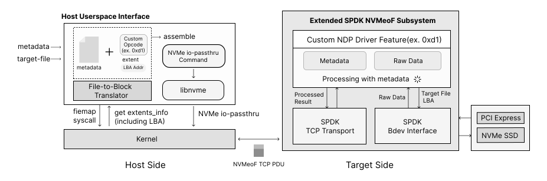

## mechanisms

이 문서는 near-data-processing 플랫폼의 핵심 작동 원리를 코드와 함께 설명합니다.



#### Host Side

Host 서버는 io를 요청할 때 SPDK에 구현된 사용자 정의 드라이버 기능을 호출하기 위해 io-passthru를 사용합니다.
io-passthru는 사용자 정의(vendor-specific)한 명령을 커스텀할 수 있는 nvme 고유 기능입니다.

1. Host 서버는 extent 기반 파일 시스템으로 포맷되어 있는 영역에서 io를 수행합니다.
- `주요 함수`: [static int passthru()](../nvme-cli/nvme.c)
- `함수 위치`: nvme-cli/nvme.c
- `함수 설명`: io-passthru를 통해 사용자로부터 입력받은 key-file(연산 메타데이터 파일)과 target-file(연산 대상 파일)을 get_file_layout 함수를 통해 extent 리스트로 전환합니다.

2. Host 서버의 nvme-cli는 연산을 요청한 파일을 logical block address의 집합인 extent로 변환합니다.
- `주요 함수`: [get_file_layout()](../nvme-cli/nvme.c)
- `함수 위치`: nvme-cli/nvme.c
- `함수 설명`: 내부적으로 fiemap이라는 시스템 콜을 통해 파일 매핑 정보를 얻어옵니다. 이 매핑 정보에 별도의 처리를 통해 Logical Block Address 주소 범위로 변환합니다.

3. 전환된 extent 정보를 cdw(command dword)에 설정하여 io-passthru 명령을 최종적으로 완성하고, libnvme를 통해 컨트롤러(Target 서버)로 명령을 전송합니다.(PDU 형태로 전송)
- `주요 함수`: [static int passthru()](../nvme-cli/nvme.c)
- `함수 위치`: nvme-cli/nvme.c

#### Target Side

NVMe over Fabric TCP Target 드라이버는 SPDK로 구성됩니다.

1. Target 서버의 SPDK TCP Transport는 Host 서버로부터 들어오는 PDU를 수신하기 위해 네트워크 스택을 폴링합니다.
- `주요 함수`: [nvmf_tcp_req_process()](../spdk/lib/nvmf/tcp.c)
- `함수 위치`: spdk/lib/nvmf/tcp.c
- `함수 설명`: 네트워크 스택으로부터 수신한 PDU를 파싱하고, PDU의 종류에 따라 여러 드라이버 기능들로 라우팅합니다. do-while문을 통해 패킷의 상태를 점전적으로 변화시키며 라우팅을 수행합니다.

2. SPDK TCP Transport 내 컨트롤러는 명령어의 타입을 검사하여 일반 IO 명령, 또는 어드민 IO 명령으로 요청을 디스패치합니다.
- `주요 함수`: [spdk_nvmf_request_exec()](../spdk/lib/nvmf/ctrlr.c)
- `함수 위치`: spdk/lib/nvmf/ctrlr.c
- `함수 설명`: 명령어의 타입을 검사하여 일반 IO 명령, 또는 어드민 IO 명령으로 요청을 디스패치합니다.

3. 일반 IO 명령 기준으로 설명드리자면, IO 명령의 opcode를 기준으로 실제 드라이버 기능으로 라우팅합니다.
- `주요 함수`: [nvmf_ctrlr_process_io_cmd()](../spdk/lib/nvmf/ctrlr.c)
- `함수 위치`: spdk/lib/nvmf/ctrlr.c
- `함수 설명`: switch 문을 통해 enum으로 정의된 opcode를 기준으로 bdev 기능을 호출합니다.
  ```c
    switch (cmd->opc) {
    case SPDK_NVME_OPC_READ:
    return nvmf_bdev_ctrlr_read_cmd(bdev, desc, ch, req);
    case SPDK_NVME_OPC_WRITE:
    return nvmf_bdev_ctrlr_write_cmd(bdev, desc, ch, req);
    case SPDK_NVME_OPC_FLUSH:
    return nvmf_bdev_ctrlr_flush_cmd(bdev, desc, ch, req);
    // CUSTOM COMMAND
    case SPDK_NVME_OPC_CUSTOM_ECHO:
    return nvmf_bdev_ctrlr_custom_echo_cmd(bdev, desc, ch, req);
    case SPDK_NVME_OPC_CUSTOM_GREP:
    return nvmf_bdev_ctrlr_custom_grep_cmd(bdev, desc, ch, req);
    ...
    ```
  
4. 사용자 정의 드라이버 기능이 호출됩니다.
- `주요 함수`: [nvmf_bdev_ctrlr_custom_echo_cmd()](../spdk/lib/nvmf/ctrlr_bdev.c)
- `함수 위치`: spdk/lib/nvmf/ctrlr_bdev.c
- `함수 설명`: 호스트의 io passthru로 부터 설정된 각종 cdw 등을 파싱하고, 첫 번째 연산에 필요한 메타데이터 파일에 대한 Read를 수행합니다. 
이 Read에 대한 콜백함수로는 연산 대상파일에 대한 Read를 호출하는 함수가 등록됩니다.

5. 사용자 정의 드라이버의 첫 번째 콜백함수가 실행됩니다.
- `주요 함수`: [nvmf_bdev_ctrlr_first_read_complete()](../spdk/lib/nvmf/ctrlr_bdev.c)
- `함수 위치`: spdk/lib/nvmf/ctrlr_bdev.c
- `함수 설명`: 첫 번째 Read에 대한 결과값을 custom_ctx 구조체 내에 복사하고, 이 구조체와 함께 연산대상파일에 대한 Read를 수행합니다.
이 Read에 대한 콜백함수로는 연산 메타데이터 파일을 읽은 결과와 연산 대상 파일을 읽은 결과를 종합하는 nvmf_bdev_ctrlr_second_read_complete() 함수가 등록됩니다.

6. 사용자 정의 드라이버의 두 번째 콜백함수가 실행됩니다.
- `주요 함수`: [nvmf_bdev_ctrlr_second_read_complete()](../spdk/lib/nvmf/ctrlr_bdev.c)
- `함수 위치`: spdk/lib/nvmf/ctrlr_bdev.c
- `함수 설명`: 첫 번째 Read에 대한 결과 값(연산 메타데이터 파일)과 두 번째 Read에 대한 결과 값(연산 대상 파일)을 바탕으로 연산을 수행하는 ndp_calculate() 함수를 수행하고, 연산 결과 값을 TCP Transport로 내보내는 역할을 합니다.

